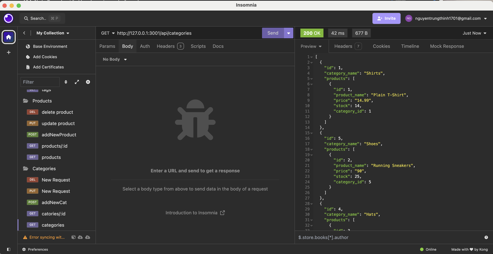

# Grocery Store
This is an Express.js application for managing categories, products, and tags in a database. The application provides RESTful API endpoints to perform CRUD operations on these entities.

## Table of Contents
- [Features](#features)
- [Installation](#installation)
- [Usage](#usage)
- [API Endpoints](#api-endpoints)
  - [Categories](#categories)
  - [Products](#products)
  - [Tags](#tags)
- [Contributing](#contributing)
- [Demo](#demo)

## Features
- CRUD operations for categories, products, and tags.
- Associations between products, categories, and tags.
- Error handling and status codes for different scenarios.

## Installation
1. Clone the repository:
    ```bash
    git clone git@github.com:swe-thinhnguyen1701/grocery-store.git
    cd your-repo
    ```

2. Install dependencies:
    ```bash
    npm install
    ```

3. Set up the database:
    - Create a `.env` file in the root of your project and add your database credentials:
        ```
        DB_NAME="ecommerce_db"
        DB_USER=your_db_user
        DB_PASSWORD=your_db_password
        ```
    - Run the database migrations:
        ```bash
        npx sequelize-cli db:migrate
        ```

4. Start the application:
    ```bash
    npm start
    ```

## Usage
The API is accessible at `http://localhost:3000`. You can use tools like Postman, curl or Insomnia to interact with the API endpoints.

## API Endpoints

### Categories
- **Get all categories**
    ```http
    GET /api/categories
    ```
    - Response: 200 OK, returns a list of all categories with their associated products.

- **Get category by ID**
    ```http
    GET /api/categories/:id
    ```
    - Response: 200 OK, returns the category with the specified ID and its associated products.
    - Response: 404 Not Found, if the category is not found.

- **Create a new category**
    ```http
    POST /api/categories
    ```
    - Request body: `{ "category_name": "New Category" }`
    - Response: 200 OK, returns the created category.

- **Update a category by ID**
    ```http
    PUT /api/categories/:id
    ```
    - Request body: `{ "category_name": "Updated Category" }`
    - Response: 200 OK, returns the updated category.
    - Response: 404 Not Found, if the category is not found.

- **Delete a category by ID**
    ```http
    DELETE /api/categories/:id
    ```
    - Response: 200 OK, returns the number of deleted records.

### Products
- **Get all products**
    ```http
    GET /api/products
    ```
    - Response: 200 OK, returns a list of all products with their associated categories and tags.

- **Get product by ID**
    ```http
    GET /api/products/:id
    ```
    - Response: 200 OK, returns the product with the specified ID and its associated categories and tags.
    - Response: 404 Not Found, if the product is not found.

- **Create a new product**
    ```http
    POST /api/products
    ```
    - Request body: 
      ```json
      {
        "product_name": "Basketball",
        "price": 200.00,
        "stock": 3,
        "tagIds": [1, 2, 3, 4]
      }
      ```
    - Response: 200 OK, returns the created product.

- **Update a product by ID**
    ```http
    PUT /api/products/:id
    ```
    - Request body: `{ "product_name": "Updated Product", "price": 150.00, "stock": 10, "tagIds": [1, 2] }`
    - Response: 200 OK, returns the updated product.
    - Response: 404 Not Found, if the product is not found.

- **Delete a product by ID**
    ```http
    DELETE /api/products/:id
    ```
    - Response: 200 OK, returns the number of deleted records.

### Tags
- **Get all tags**
    ```http
    GET /api/tags
    ```
    - Response: 200 OK, returns a list of all tags with their associated products.

- **Get tag by ID**
    ```http
    GET /api/tags/:id
    ```
    - Response: 200 OK, returns the tag with the specified ID and its associated products.
    - Response: 404 Not Found, if the tag is not found.

- **Create a new tag**
    ```http
    POST /api/tags
    ```
    - Request body: `{ "tag_name": "New Tag" }`
    - Response: 200 OK, returns the created tag.

- **Update a tag by ID**
    ```http
    PUT /api/tags/:id
    ```
    - Request body: `{ "tag_name": "Updated Tag" }`
    - Response: 200 OK, returns the updated tag.
    - Response: 404 Not Found, if the tag is not found.

- **Delete a tag by ID**
    ```http
    DELETE /api/tags/:id
    ```
    - Response: 200 OK, returns the number of deleted records.

## Contributing
Contributions are welcome! Please open an issue or submit a pull request.

## Demo
[](https://youtu.be/_WD229q-sQc)